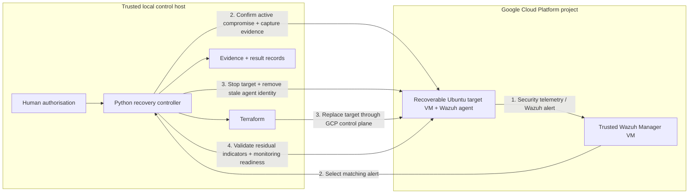

# IaC Recovery Assurance for Runtime-Compromised Cloud VMs

**MSc Computing (Applied Cyber Security) - Technological University Dublin**

**Wazuh detects. Python coordinates. Terraform replaces. Validation decides when recovery is complete.**

## Research question

> **How effective is an Infrastructure-as-Code (IaC)-based recovery workflow for a stateless cloud virtual machine after controlled runtime compromise?**

The project evaluates a human-authorised recovery workflow for a replaceable Ubuntu 22.04 virtual machine on Google Cloud Platform (GCP). A successfully rebuilt VM is not automatically treated as recovered: recovery is accepted only after the triggering compromise is confirmed active, required pre-destruction evidence is captured, the compromised VM is stopped, Terraform creates a replacement, attack-specific indicators are absent, and Wazuh monitoring is ready again.

## Big-picture architecture

The experiment uses two trust/recovery roles inside the **same GCP project**, plus an external trusted controller host:

- **Trusted monitoring side in GCP:** a separate Wazuh Manager VM receives alerts and maintains agent identity/state.
- **Recoverable target in GCP:** the Terraform-managed Ubuntu target VM runs the Wazuh agent and is treated as untrusted after controlled compromise.
- **Trusted local Windows host:** the Python controller, Terraform CLI, Google Cloud tooling, and experiment result/evidence handling run outside the target VM.

The Wazuh Manager is therefore separate from the recoverable target, but **it is not outside GCP**. Their separation is a trust and recovery boundary, not a different cloud location.



The four stages are:

1. **Detect** - Wazuh records the relevant security event.
2. **Confirm and preserve** - the controller selects the matching alert, confirms that malicious state is still active, and captures all mandatory evidence positions.
3. **Contain and replace** - the controller performs stop-based containment, removes the stale Wazuh agent registration, and invokes Terraform replacement.
4. **Validate and accept** - attack-specific residual indicators must be absent and Wazuh monitoring/File Integrity Monitoring (FIM) must be ready before the controller records `PASS`.

For one complete scenario, see **[Worked example: malicious cron compromise to accepted recovery](docs/CRON_END_TO_END_WALKTHROUGH.md)**.

## Evaluated compromise scenarios

| Scenario | Compromise class | Post-recovery checks |
|---|---|---|
| Unauthorised SSH public key | Authentication persistence | Injected key absent; legitimate `authorized_keys` remains |
| Unauthorised local user | Identity / privilege persistence | Account, home directory and sudo membership absent |
| Malicious cron job | Scheduled persistence | Cron definition and payload artefact absent |
| Malicious systemd service | Service / boot persistence | Service, script, process and supporting artefacts absent |
| Unexpected TCP listener | Runtime network foothold | Port, process, PID and log indicators absent |

The TCP listener is deliberately **not presented as reboot persistence**. The final experiment definition is in [`results/experiment_matrix.csv`](results/experiment_matrix.csv).

## Frozen primary results

The primary dataset contains **25 formal runs - five repetitions per scenario**.

| Result | Observed value |
|---|---:|
| Complete accepted recoveries | **25 / 25** |
| Required evidence-item instances captured | **185 / 185** |
| Predefined post-recovery checks passed | **85 / 85** |
| Predefined residual indicators remaining | **0** |
| Runs with full monitoring/FIM readiness | **25 / 25** |
| Mean complete controller workflow | **980.37 s** |
| Mean detection + active confirmation | **19.33 s** |
| Mean evidence capture | **38.26 s** |
| Mean stop-based containment | **73.91 s** |
| Mean stale Wazuh agent cleanup | **64.70 s** |
| Mean Terraform replacement | **129.06 s** |
| Mean post-recovery validation | **655.09 s** |
| Mean monitoring restoration, nested in validation | **642.99 s** |

The main finding is the **recovery-assurance gap**: infrastructure replacement completed substantially earlier than the point at which the workflow could justify accepting the workload as recovered.

For the exact controller checks behind **185/185** and **85/85**, see **[Evidence and validation traceability](docs/EVIDENCE_AND_VALIDATION_TRACEABILITY.md)**.

Derived timing tables have been regenerated from the frozen dataset under [`results/analysis/`](results/analysis/). Generated plots are intentionally not stored on this branch after the final dataset refresh; they can be regenerated from the scripts in [`analysis/`](analysis/).

## Monitoring-readiness A/B control

A separate three-pair A/B control tested whether an active Wazuh agent service was equivalent to fresh real-time FIM readiness. **Pair 1, Pair 2 and Pair 3 are three repetitions of the same paired comparison.** Within each repetition, condition A tests a matching event before confirmed FIM readiness and condition B repeats it after confirmed readiness.

The observations are in [`results/controls/fim_readiness_cron_ab_final.csv`](results/controls/fim_readiness_cron_ab_final.csv).

- Mean agent-active to FIM-ready gap: **473.23 s**
- Mean matching-alert delay before readiness: **455.26 s**
- Mean matching-alert delay after readiness: **~0.008 s**

This is a study-specific control on the cron/FIM path, not a claim about every Wazuh deployment.

## Key repository artefacts

```text
iac-self-healing-thesis/
├── Terraform/                 # GCP target VM and trusted IaC baseline
├── controller/                # attack, detection, evidence, recovery and validation logic
├── analysis/                  # frozen-dataset build and analysis scripts
├── docs/
│   ├── CRON_END_TO_END_WALKTHROUGH.md
│   └── EVIDENCE_AND_VALIDATION_TRACEABILITY.md
├── results/
│   ├── experiment_matrix.csv
│   ├── formal_run_manifest.csv
│   ├── included_main_results.csv
│   ├── *_formal_results.csv
│   ├── controls/
│   └── analysis/
├── REPRODUCIBILITY.md
└── CITATION.cff
```

The authoritative [`results/included_main_results.csv`](results/included_main_results.csv) is fingerprinted with SHA-256:

```text
a6171d1f1246151a9e235df45019779b4573ba7b8b29374e864323f8adb97de7
```

See [REPRODUCIBILITY.md](REPRODUCIBILITY.md) for timing boundaries, software versions, controls and replication notes.

## Scope and interpretation

This is a controlled MSc experiment, not a production incident-response platform. It evaluates one replaceable stateless Ubuntu VM on GCP, a separate trusted Wazuh Manager, an external trusted Windows/Python controller, a trusted Terraform baseline/cloud account, five controlled compromise conditions, and descriptive analysis with `n = 5` formal repetitions per scenario.

The evidence checklist is a **protocol-compliance measure**, not a complete legal-forensics acquisition. Zero residual indicators means that the **predefined indicators for the injected condition** were absent; it does not prove the absence of every possible unknown compromise.

All attack injections were performed against researcher-controlled cloud resources. Private keys, Terraform state, `.tfvars`, raw evidence folders and controller runtime state are intentionally excluded from version control.

## Author

**Adith Menon**  
MSc Computing (Applied Cyber Security)  
Technological University Dublin  
2026
