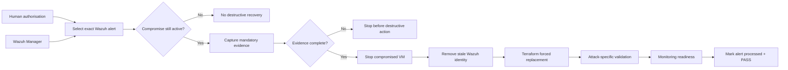
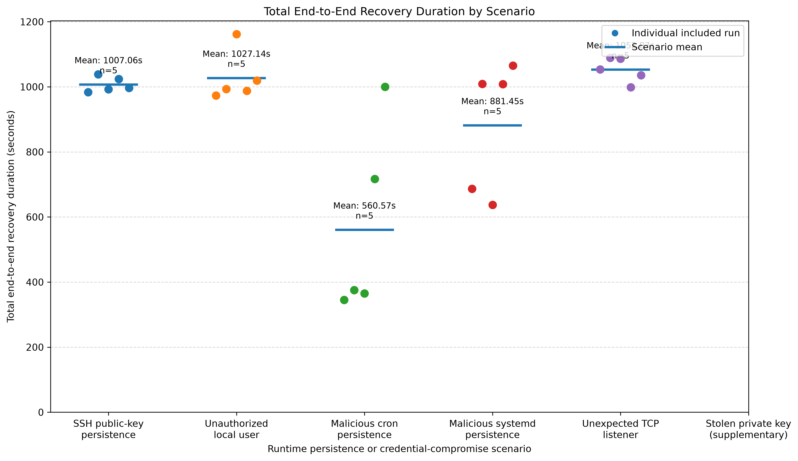
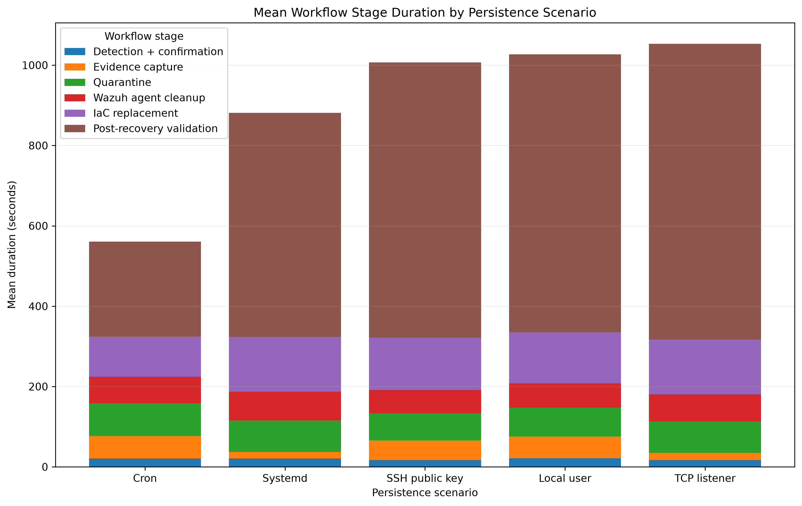

<div align="center">

# IaC Recovery Assurance for Runtime-Compromised Cloud VMs

**MSc Computing (Applied Cyber Security) — Technological University Dublin**


**Wazuh detects. Python coordinates. Terraform replaces. Validation decides when recovery is complete.**

</div>

---

## Research question

> **How effective is an Infrastructure-as-Code (IaC)-based recovery workflow for a stateless cloud virtual machine after controlled runtime compromise?**

The project evaluates a human-authorised recovery workflow for a replaceable Ubuntu 22.04 VM on Google Cloud Platform. The central idea is simple:

> **A successfully rebuilt VM is not automatically a recovered VM.**

Recovery is accepted only after the triggering compromise is confirmed active, required pre-destruction evidence is captured, the compromised VM is stopped, Terraform creates a replacement, attack-specific indicators are absent, and Wazuh monitoring is ready again.

## Recovery workflow



The controller is **not a fully autonomous SOAR platform**. A human retains the high-impact decision to start destructive recovery; the controller then enforces the predefined sequence.

## Evaluated compromise scenarios

| Scenario | Compromise class | What is validated after replacement |
|---|---|---|
| Unauthorised SSH public key | Authentication persistence | Malicious key absent; legitimate SSH state remains |
| Unauthorised local user | Identity / privilege persistence | Account, home directory and sudo membership absent |
| Malicious cron job | Scheduled persistence | Cron definition and payload artefact absent |
| Malicious systemd service | Service / boot persistence | Service, process and supporting artefacts absent |
| Unexpected TCP listener | **Runtime network foothold** | Port, process, PID/log indicators absent |

The TCP listener is deliberately **not presented as reboot persistence**. It tests whether the same recovery protocol can handle unauthorised live process/socket state.

## Headline results

The frozen primary dataset contains **25 formal runs** — five repetitions per scenario.

| Result | Observed value |
|---|---:|
| Formal runs reaching the complete acceptance state | **25 / 25** |
| Required evidence-item instances captured | **185 / 185** |
| Predefined post-recovery checks passed | **85 / 85** |
| Predefined residual indicators remaining | **0** |
| Runs with full monitoring/FIM readiness recorded | **25 / 25** |
| Mean complete controller workflow | **980.37 s** |
| Mean Terraform replacement stage | **129.06 s** |
| Mean post-recovery validation | **655.09 s** |
| Mean monitoring restoration *(nested in validation)* | **642.99 s** |

The main finding is the **recovery-assurance gap**: infrastructure replacement completed far earlier than the point at which the workflow could justify accepting the workload as recovered.

### End-to-end duration



### Stage-level duration



## Monitoring-readiness control

A separate three-pair A/B control tested whether an active Wazuh agent service was equivalent to fresh real-time File Integrity Monitoring readiness.

- Mean agent-active → FIM-ready gap: **473.23 s**
- Mean matching-alert delay before readiness: **455.26 s**
- Mean matching-alert delay after readiness: **~0.008 s**

This is a **study-specific control on the cron/FIM path**, not a claim about every Wazuh deployment.

## Repository structure

```text
iac-self-healing-thesis/
├── Terraform/                 # GCP target VM and trusted IaC baseline
├── controller/                # detection, evidence, recovery and validation logic
├── analysis/                  # dataset build, timing analysis and figure generation
├── results/
│   ├── formal_run_manifest.csv
│   ├── included_main_results.csv
│   ├── *_formal_results.csv   # raw scenario result histories
│   ├── controls/              # stale-alert, evidence-gate and FIM-readiness controls
│   ├── analysis/              # generated stage summaries
│   └── figures/               # thesis-facing plots
├── REPRODUCIBILITY.md
└── CITATION.cff
```

## Reproducing the reported dataset

The primary dataset is selected by an explicit **frozen run manifest**, not by filtering rows for `PASS`.

```bash
python analysis/build_frozen_dataset.py
python analysis/analyze_stage_timings.py
python analysis/generate_results_table_1.py
python analysis/generate_results_figure_1.py
python analysis/generate_stage_timing_figure.py
```

The authoritative `results/included_main_results.csv` is fingerprinted with SHA-256. See [REPRODUCIBILITY.md](REPRODUCIBILITY.md) for the exact hash, timing boundaries, software versions and replication notes.

## Scope and trust assumptions

This is a controlled MSc experiment, not a production incident-response platform. The conclusions are bounded to:

- one replaceable stateless Ubuntu VM;
- Google Cloud Platform;
- a separate trusted Wazuh Manager;
- an external trusted Windows/Python controller;
- a trusted Terraform baseline and cloud account;
- five controlled compromise conditions;
- descriptive analysis with `n = 5` formal repetitions per scenario.

The evidence checklist is a **protocol-compliance measure**, not a complete legal-forensics acquisition. Zero residual indicators means that the **predefined indicators for the injected condition** were absent; it does not prove the absence of every possible unknown compromise.

## Safety

All attack injections were performed against researcher-controlled cloud resources. Private keys, Terraform state, `.tfvars`, evidence folders and runtime state are intentionally excluded from version control.

## Author

**Adith Menon**  
MSc Computing (Applied Cyber Security)  
Technological University Dublin  
2026
