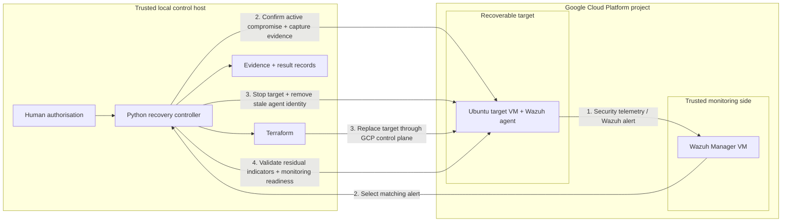

<div align="center">

# IaC Recovery Assurance for Runtime-Compromised Cloud VMs

**MSc Computing (Applied Cyber Security) — Technological University Dublin**


**Wazuh detects. Python coordinates. Terraform replaces. Validation decides when recovery is complete.**

</div>

---

## Research question

> **How effective is an Infrastructure-as-Code (IaC)-based recovery workflow for a stateless cloud virtual machine after controlled runtime compromise?**

The project evaluates a human-authorised recovery workflow for a replaceable Ubuntu 22.04 virtual machine on Google Cloud Platform (GCP). The central idea is:

> **A successfully rebuilt VM is not automatically a recovered VM.**

Recovery is accepted only after the triggering compromise is confirmed active, required pre-destruction evidence is captured, the compromised VM is stopped, Terraform creates a replacement, attack-specific indicators are absent, and Wazuh monitoring is ready again.

## Big-picture architecture

The experiment uses two trust/recovery roles inside the same GCP project plus an external trusted controller host:

- **GCP project — trusted monitoring side:** a separate Wazuh Manager VM receives alerts and maintains agent identity/state.
- **GCP project — recoverable target:** the Terraform-managed Ubuntu target VM runs the Wazuh agent and is treated as untrusted after the controlled compromise is injected.
- **Trusted local Windows host:** the Python controller, Terraform CLI, Google Cloud tooling and experiment result/evidence handling run outside the target VM.

The Wazuh Manager is therefore **separate from the recoverable target, but it is not outside GCP**. Their separation is a trust and recovery boundary, not a different cloud location.

## Recovery workflow



The four stages are:

1. **Detect** — Wazuh records the relevant security event.
2. **Confirm and preserve** — the controller selects the matching alert, confirms that the malicious state is still active, and captures all mandatory evidence positions.
3. **Contain and replace** — the controller performs stop-based containment, removes the stale Wazuh agent registration, and invokes Terraform replacement.
4. **Validate and accept** — attack-specific residual indicators must be absent and Wazuh monitoring/FIM must be ready before the controller records `PASS`.

The controller is **not a fully autonomous SOAR platform**. A human retains the high-impact decision to start destructive recovery; the controller then enforces the predefined sequence.

For a complete example that connects the attack, Wazuh alert, controller, evidence gate, Terraform and validation, see **[Worked example: malicious cron compromise to accepted recovery](docs/CRON_END_TO_END_WALKTHROUGH.md)**.

## Evaluated compromise scenarios

| Scenario | Compromise class | What is validated after replacement |
|---|---|---|
| Unauthorised SSH public key | Authentication persistence | Injected key absent; legitimate `authorized_keys` state remains |
| Unauthorised local user | Identity / privilege persistence | Account, home directory and sudo membership absent |
| Malicious cron job | Scheduled persistence | Cron definition and payload artefact absent |
| Malicious systemd service | Service / boot persistence | Service, script, process and supporting artefacts absent |
| Unexpected TCP listener | **Runtime network foothold** | Port, process, PID and log indicators absent |

The TCP listener is deliberately **not presented as reboot persistence**. It tests unauthorised live process/socket state under the same recovery-acceptance protocol.

The final experiment definition is recorded in [`results/experiment_matrix.csv`](results/experiment_matrix.csv).

## Headline results

The frozen primary dataset contains **25 formal runs** — five repetitions per scenario.

| Result | Observed value |
|---|---:|
| Formal runs reaching the complete acceptance state | **25 / 25** |
| Required evidence-item instances captured | **185 / 185** |
| Predefined post-recovery checks passed | **85 / 85** |
| Predefined residual indicators remaining | **0** |
| Runs with full monitoring/FIM readiness recorded | **25 / 25** |
| Mean complete controller workflow | **980.37 s** |
| Mean detection + active confirmation | **19.33 s** |
| Mean evidence capture | **38.26 s** |
| Mean stop-based containment | **73.91 s** |
| Mean stale Wazuh agent cleanup | **64.70 s** |
| Mean Terraform replacement stage | **129.06 s** |
| Mean post-recovery validation | **655.09 s** |
| Mean monitoring restoration *(nested in validation)* | **642.99 s** |

The main finding is the **recovery-assurance gap**: infrastructure replacement completed substantially earlier than the point at which the workflow could justify accepting the workload as recovered.

For the exact denominator and controller source behind **185/185** and **85/85**, see **[Evidence and validation traceability](docs/EVIDENCE_AND_VALIDATION_TRACEABILITY.md)**.

### End-to-end duration


### Stage-level duration


## Monitoring-readiness A/B control

A separate three-pair A/B control tested whether an active Wazuh agent service was equivalent to fresh real-time File Integrity Monitoring (FIM) readiness.

**Pair 1, Pair 2 and Pair 3 are simply three repetitions of the same paired comparison.** Within each repetition:

- **Condition A** injects/checks a matching cron/FIM event before confirmed FIM readiness.
- **Condition B** repeats the matching event after confirmed FIM readiness.

The three observed pairs are stored in [`results/controls/fim_readiness_cron_ab_final.csv`](results/controls/fim_readiness_cron_ab_final.csv).

- Mean agent-active → FIM-ready gap: **473.23 s**
- Mean matching-alert delay before readiness: **455.26 s**
- Mean matching-alert delay after readiness: **~0.008 s**

This is a **study-specific control on the cron/FIM path**, not a claim about every Wazuh deployment.

## Repository structure

```text
iac-self-healing-thesis/
├── Terraform/                 # GCP target VM and trusted IaC baseline
├── controller/                # attack, detection, evidence, recovery and validation logic
├── analysis/                  # frozen-dataset build, timing analysis and figure generation
├── docs/
│   ├── CRON_END_TO_END_WALKTHROUGH.md
│   └── EVIDENCE_AND_VALIDATION_TRACEABILITY.md
├── results/
│   ├── experiment_matrix.csv
│   ├── formal_run_manifest.csv
│   ├── included_main_results.csv
│   ├── *_formal_results.csv   # scenario result histories
│   ├── controls/              # stale-alert, evidence-gate and FIM-readiness controls
│   ├── analysis/              # derived stage summaries
│   └── figures/               # thesis-facing plots
├── REPRODUCIBILITY.md
└── CITATION.cff
```

## Reproducing the reported dataset

The primary dataset is selected by an explicit frozen run manifest. The dataset builder copies the manifest-listed observations and does not filter the selected rows by `final_result`.

```bash
python analysis/build_frozen_dataset.py
python analysis/analyze_stage_timings.py
python analysis/generate_results_table_1.py
python analysis/generate_results_figure_1.py
python analysis/generate_stage_timing_figure.py
```

The authoritative [`results/included_main_results.csv`](results/included_main_results.csv) is fingerprinted with SHA-256:

```text
a6171d1f1246151a9e235df45019779b4573ba7b8b29374e864323f8adb97de7
```

See [REPRODUCIBILITY.md](REPRODUCIBILITY.md) for timing boundaries, software versions, controls and replication notes.

## Scope and trust assumptions

This is a controlled MSc experiment, not a production incident-response platform. The conclusions are bounded to:

- one replaceable stateless Ubuntu VM;
- Google Cloud Platform;
- a separate trusted Wazuh Manager;
- an external trusted Windows/Python controller;
- a trusted Terraform baseline and cloud account;
- five controlled compromise conditions;
- descriptive analysis with `n = 5` formal repetitions per scenario.

The evidence checklist is a **protocol-compliance measure**, not a complete legal-forensics acquisition. Zero residual indicators means that the **predefined indicators for the injected condition** were absent; it does not prove the absence of every possible unknown compromise.

## Safety

All attack injections were performed against researcher-controlled cloud resources. Private keys, Terraform state, `.tfvars`, raw evidence folders and controller runtime state are intentionally excluded from version control.

## Author

**Adith Menon**  
MSc Computing (Applied Cyber Security)  
Technological University Dublin  
2026
